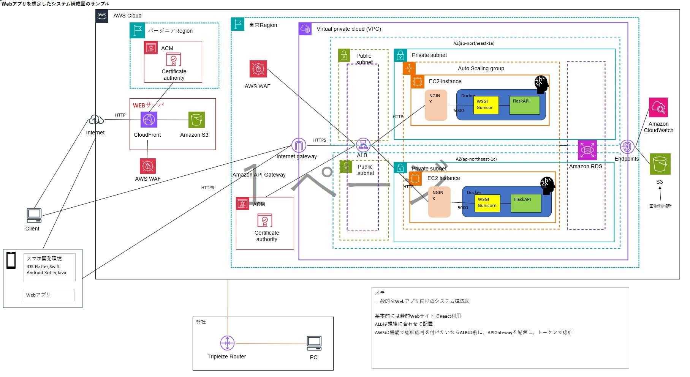

## 概要

MLOps の Cloudfromation の実現に向けて

## システム構成図

下記は MLOps の一部


## memo

alb_ec2sample.yaml でスタックは成功するが、ヘルスチェックに引っかかる  
Nginx でヘルスチェックルートを作成する必要がありそう。  
後は Docker で Flask の API を持ってこれば行けそう。

下記を追加して検証したい。

```
  EC2Instance:
    Type: AWS::EC2::Instance
    Properties:
      # ... 既存プロパティは省略 ...
      UserData:
        Fn::Base64: !Sub |
          #!/bin/bash
          # nginx インストール
          amazon-linux-extras enable nginx1
          yum install -y nginx
          # 簡易な /health 返却ページを用意
          echo "OK" > /usr/share/nginx/html/health.html
          # デフォルトサーバをリバースプロキシに書き換え
          cat > /etc/nginx/conf.d/flask.conf << 'EOF'
          server {
            listen       80;
            location /health {
              alias /usr/share/nginx/html/health.html;
            }
            location / {
              proxy_pass         http://127.0.0.1:5000;
              proxy_set_header   Host $host;
              proxy_set_header   X-Real-IP $remote_addr;
            }
          }
          EOF
          # Nginx 起動＆自動起動設定
          systemctl enable nginx
          systemctl start nginx
          # （必要に応じて）Flask アプリの起動
          # cd /home/ec2-user/app && nohup gunicorn app:app -b 127.0.0.1:5000 &

```
