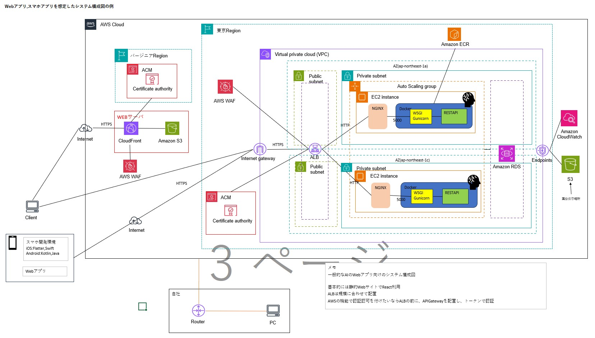

## 概要

MLOps の Cloudfromation の実現に向けて

## システム構成図

下記は MLOps の一部


## memo

alb_ec2sample.yaml は ACM に外部証明書か、AWS で発行した無料の証明書を発行している前提。
alb_ec2sample.yaml でスタックは成功するが、ヘルスチェックに引っかかる  
Nginx でヘルスチェックルートを作成する必要がありそう。  
後は Docker で Flask の API を持ってこれば行けそう。
下記を追加して検証したい。

```
# ターゲットグループ（ヘルスチェックパスを/healthに変更）
  TargetGroup:
    Type: AWS::ElasticLoadBalancingV2::TargetGroup
    DependsOn:
      - EC2Instance
    Properties:
      Name: !Sub "${AWS::StackName}-tg"
      Protocol: HTTP
      Port: 80
      VpcId: !Ref VpcId
      TargetType: instance
      HealthCheckProtocol: HTTP
      HealthCheckPath: /health  # ← ここを変更
      Matcher:
        HttpCode: "200"
      Targets:
        - Id: !Ref EC2Instance
          Port: 80

  # EC2 インスタンス（シンプルなNginx + ヘルスチェック）
  EC2Instance:
    Type: AWS::EC2::Instance
    Properties:
      InstanceType: !Ref InstanceType
      ImageId: !Ref AmiId
      KeyName: !Ref KeyName
      NetworkInterfaces:
        - AssociatePublicIpAddress: true
          DeviceIndex: 0
          SubnetId: !Select [0, !Ref SubnetIds]
          GroupSet:
            - !Ref InstanceSecurityGroup
      UserData:
        Fn::Base64: !Sub |
          #!/bin/bash
          # システムアップデート
          apt-get update -y

          # Nginxインストール
          apt-get install -y nginx

          # ヘルスチェック用設定
          cat > /etc/nginx/sites-available/health << 'EOF'
          server {
              listen 80;
              server_name _;

              # ヘルスチェックエンドポイント
              location /health {
                  access_log off;
                  return 200 "healthy\n";
                  add_header Content-Type text/plain;
              }

              # デフォルトページ
              location / {
                  root /var/www/html;
                  index index.html;
              }
          }
          EOF

          # デフォルトサイトを無効化して新しい設定を有効化
          rm -f /etc/nginx/sites-enabled/default
          ln -s /etc/nginx/sites-available/health /etc/nginx/sites-enabled/

          # Nginxを起動・自動起動設定
          systemctl start nginx
          systemctl enable nginx
      Tags:
        - Key: Name
          Value: !Ref Ec2Name

```
